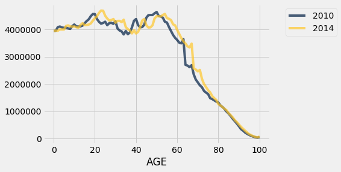

## Data 8 Cheat Sheet


This is a really condensed version of the docs that will keep updating throughout the semester to highlight the most crucial functions at any given time. It's a happy medium between the [Python reference](http://data8.org/fa19/python-reference.html) and the [textbook](https://www.inferentialthinking.com/chapters/intro).

#### PSA: Something missing/unclear? Contribute to the cheat sheet!!! [Edit the text directly](https://github.com/64bitpandas/data8-cheat-sheet/edit/master/README.md) or [Create an issue](https://github.com/64bitpandas/data8-cheat-sheet/issues)!

## Stats Notes

### [CLICK HERE!](./StatsNotes)

## Hot Functions
Stuff we just learned and is probably quite confuzzling at the moment.

**Correlation Coefficient:**
```python
# with a table of points values for the two variables x/y in standard units
t = t.with_columns('x_st', x_st, 'y_st', y_st)

#create a column of products
products = x_st * y_st
t = t.with_column('products', products)

#take mean of the products to get the correlation coefficient
r = np.mean(products)

```

**Rows:**
```
#to do k nearest neighbor, iterating over rows after removing the class is most efficient in this way.
# row_distance is a function that takes two row objects and computes their difference.
attributes_only = table.drop('Class')
for row in attributes_only.rows:
    distances = np.append(distances, row_distance(row, example))

#to read a row as an array, use np.array(t.row(i))
rows = np.array(t.row(i))

#t.rows is an attribute that returns all the rows of a table. rows are row objects
for row in t.rows:
    #do anything to the row
```


**Standardized Units (aka Z score):**
```def standard_units(x):
    return (x - np.mean(x))/np.std(x)
```
    -Converts values in an array to their standard unit values and returns an array
    -Example: `standard_units(make_array(1, 2, 3, 4, 5))` returns `array([-1.41421356, -0.70710678,  0. , 0.70710678, 1.41421356])`

**Standard Deviation:** 

`np.std(array)` calculates the standard deviation of a given array.
    - Example: `np.std(make_array(1, 2, 3, 4, 5)) returns 2
        - Explanation: mean is 3
        - Differences are [-2, -1, 0, 1, 2]
        - Square of differences are [4, 1, 0, 1, 4]
        - Sum of square of differences is 10
        - 10 / (num points 1) = 10 / (5) = 2
        - sqrt(2) = 1.41421357...
    - If you want **sample standard deviation** use `np.std(array, ddof = 1)`

**Creating prefilled arrays:** 

`np.full(length, value)` creates an array of length `length` filled with `value`
    - Example: `np.full(4, 2)` returns `[2, 2, 2, 2]`
    
**Percentile:** The value is the at least as large as the X% of elements. Always round up. Whether it is sorted does not matter.
 - Example:
 ```python
  percentile(x , s) ##x is a number and s is an array
  ## returns item of the array that is at the specified percentile
  s = [9,3,5,7,1]
  percentile(80 , s)
  ##returns 7, (4th largest element)
  ##80th percentile is (80/100 * 5  = 4) so it is the 4th element
  ##75th percentile is also 7 because of rounding
  ```
**Sampling and Distributions**

 - Random Sampling
```python
# Takes n random rows WITH REPLACEMENT from `tbl`, then grabs the array of values in `Column Name`.
tbl.sample(n).column('Column Name')

# NO replacement
tbl.sample(n, with_replacement=False)
```
 - Categorical Sampling
 ```python
 # Out of a random sample of size sample_size, the proportion of times each value in probability_distribution was picked
 sample_proportions(sample_size, probability_distribution)
 # Probability_distribution is an array that has probability values.
 # Returns an array of simulated proportions.

 # Example:
 probability_distribution = make_array(.26, .74)
 sample_proportions(100, probability_distribution)
 # Output should be around [.26, .74] but with some variability
```


**Comparisons**

 - Arrays: An array can have operations done on all the individual values of that array.
 ```python
    pets = make_array('cat', 'dog', 'fire breathing anteater')
    pets == 'cat' # returns array [True, False, False]
    sum(pets == 'cat') # returns 1 since True is equivalent to 1 and False is equivalent to 0
    np.count_nonzero(pets) # Returns 3. same thing as sum, but works for non-boolean arrays.
 ```
    

**Maps**

A table with 3 columns: latitude, longitude, and name of location is required as a parameter.
```python
# Makes a map with pins
Marker.map_table(table.select('lat', 'long', 'name'))
# Makes a map with green circles of radius 10
Circle.map_table(table.select('lat', 'long', 'name'), color='green', radius=10)
# Makes a map with variable colors and sizes
Circle.map_table(table.select('lat', 'long', 'name', 'color', 'size'))
```

**Pivot Tables**
 - The top left cell in the table is reserved for the label for the leftmost column.
```python
# Puts the values in the first column to the column names in the pivot table, and the values in the second column to the row names in the pivot table.
table.pivot('Column to columns', 'Column to rows', 'Values', func_to_apply)
```

**Joining two tables**
 - If something in Table1 Column is not found in Table2 Column, that row is left out of the joined table!
 - The leftmost column is always the `Shared Column`. If `Table2 Column` was specified then its name is `Table1 Column`.
 - If there are multiple entries per value in the joined column, all possible combinations will be added to the joined table.
 - The columns of `table1` appear to the left of all the columns of `table2`.
```python
# Match rows in table1 using values in 'Table1 Column' with rows in table2 using values in 'Table2 Column'.
table1.join('Table1 Column', table2, 'Table2 Column')

# If Table1 Column and Table2 Column have the same name, the call instead is
table1.join('Shared Column', table2)
```

**Grouping a Table**
 - The default `func_to_apply` is to count the number of rows for each category in `Column 1`.
 - If `func_to_apply` is undefined on a specific column (e.g. trying to `sum` a bunch of strings) then the column will still exist, but will be empty.
```python
# Makes a table with all possible combinations of values in the two columns, then applies func_to_apply to the REMAINING columns in the table.
table.group(['Column 1', 'Column 2'], func_to_apply)
```

## Table Visualizations


**Plotting a table's column as a line**
```python
# plots the column as the x axis. Every column after it will be represented as lines in the line graph.
table.plot('column_name')

#can also plot by x,y. Makes a single line
table.plot('x_column','y_column')
```

In the example below, `table.plot('AGE')` was called on a `table` with three columns: `AGE`, `2010`, and `2014`.


**Plotting a table's column as a histogram**

 - **Percent per unit:** The percentage of the total data represented by 1 unit of the x-value. The area of a bar on the histogram is the percentage of total data represented inside that particular bin.

```python
# Creates a histogram of column values vs. percent per unit.
tbl.hist('Column')

# Optional bins value: can be either one number (specifying number of bins) or an array (specifying the bin start/stop values)
tbl.hist('Column', bins=100) # 100 bins
tbl.hist('Column', bins=np.arange(1, 10)) # 9 bins of equal width 1

# Optional unit value: Instead of percent per unit, it's percent per second or percent per mile, etc.
tbl.hist('Column', unit='second')
```


## Table Operations

**Creating a table:**
```python
# both are equivalent
tbl = Table.read_table('tablename.csv')
tbl = Table().read_table('tablename.csv')
```

**Converting a table column into an array:**
```python
arr = tbl.column('column name')
```

**Creating a table column from an array:**
```python
# Remember to re-assign the original table if you want the new table to be saved!
tbl = tbl.with_column('column name', arr)

# Make as many columns as you want in a single function call!
tbl = tbl.with_columns('first column', arr1, 'second column', arr2, ... ,'nth column', arr_n)
```

**Getting specific rows or columns from a table**
```python
# ROW: Pass in either an array/list of 0-indexed row numbers, OR a single number.
first_row_only = tbl.take(0)
every_third_row = tbl.take(np.arange(0, tbl.num_rows, 3))

# COLUMN: Pass in either an array of column names, an array of column indices, OR individual names/indices.
first_col_only = tbl.column(0)
dank_memes_only = tbl.column('Deep Fried Memes')
```

**Sorting a Table**

Used to easily find max/min of a table, or check if a table has duplicate entries.
```python
# Default: starts at the lowest value and repeats are allowed. With descending=True, starts at the highest value instead. With distinct=False, repeats are ignored.
table.sort(column, descending=False, distinct=True)
```

## np aka "numpy"
**Creating an array which is a range of numbers**
```python
# Makes a range that goes from n1 to n2. Can optionally increment by n3. 
# n1, n2, n3 are all integers
arr_range = np.arange(n1,n2,n3=1)
```
**Calculating an average value / mean from a given array**
```python
np.average(array)
```
**Creating a new array that is the difference between sequential elements in a given array**
```python
#len of returned array is len(array)-1
# a=a-b
# b=b-c
# ...
np.diff(array)
```
**Creating a new array with elements that are in the form of (current element + all previous elements)**
```python
np.cumsum(array)
```
**Random Number:**
For returning a random result from an array. Can specify to return multiple results equal to num_times. If multiple are specified, it returns an array. Selects with replacement.
(Clarification: num_times is OPTIONAL. Default value: 1)
```python
np.random.choice(array,num_times=1) # Get an array of num_times random elements from array.

sum(np.random.choice(array, num_times) == 'value in array') # Returns total number of times 'value in array' appeared inside the random selection
```
**Appending:**
For adding to an existing array. Can either add a single value or another array. 
 - Creates and returns a new array(Chaining it with other array opperations work!). If you want to save the new appended array, assign it to something!
```python
array_1 = np.append(array_1,value) # adds the value to the end of array_1
array_1 = np.append(array_1,array_2) # adds the values of array_2 to array_1
```

**For Statements:**
Used for various applications where you know how many times you want to do something.
```python
for var in array:
    (something)
# runs the (something) multiple times for every element of your array. Additionally assigns a temperary variable to var which is the value in that array for a certain iteration. Ex: the first time the (something) is executed, var is the first element of the array. 
for pet in make_array('cat','rabbit', 'dragon')
    print(pet)
##In this case, every element of the array is printed.
```


<!-- 
You can use the [editor on GitHub](https://github.com/64bitpandas/data8-cheat-sheet/edit/master/README.md) to maintain and preview the content for your website in Markdown files.

Whenever you commit to this repository, GitHub Pages will run [Jekyll](https://jekyllrb.com/) to rebuild the pages in your site, from the content in your Markdown files.

### Markdown

Markdown is a lightweight and easy-to-use syntax for styling your writing. It includes conventions for

```python
def hi():
    a = b + 1
    return a
```

```markdown
Syntax highlighted code block

# Header 1
## Header 2
### Header 3

- Bulleted
- List

1. Numbered
2. List

**Bold** and _Italic_ and `Code` text

[Link](url) and 
```

For more details see [GitHub Flavored Markdown](https://guides.github.com/features/mastering-markdown/).

### Jekyll Themes

Your Pages site will use the layout and styles from the Jekyll theme you have selected in your [repository settings](https://github.com/64bitpandas/data8-cheat-sheet/settings). The name of this theme is saved in the Jekyll `_config.yml` configuration file.

### Support or Contact

Having trouble with Pages? Check out our [documentation](https://help.github.com/categories/github-pages-basics/) or [contact support](https://github.com/contact) and we’ll help you sort it out.


**Bold** _italic_  -->